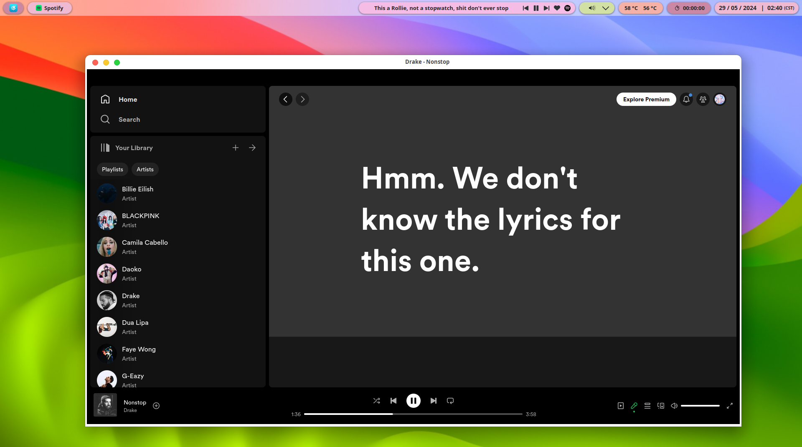
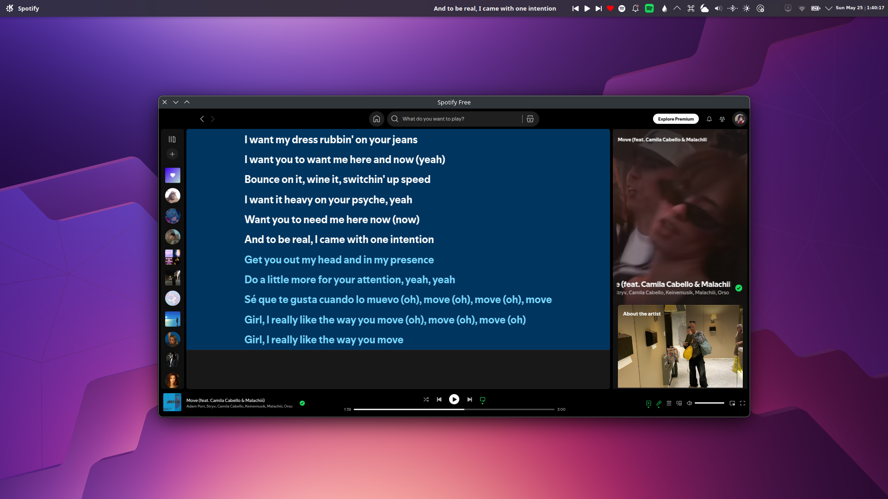
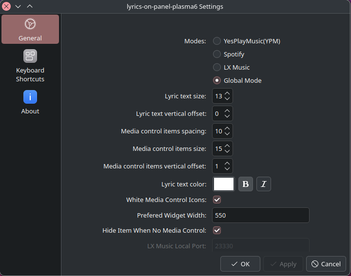

# Plasma6-Lyric-on-panel

> This widget is a fork of the great widget [Lyrics-on-Panel](https://github.com/KangweiZhu/lyrics-on-panel) by KangweiZhu. The original widget requires a lot of space on the panel.
> So, I decided to make a new widget that automatically splits the lyrics into multiple lines and displays them on the panel.
> Furthermore, I rearranged the layout of the widget to make it more compact.
> Finally, I aim to translate the Chinese comments into English, and make the widget more user-friendly.
> Hope you enjoy it!
> Last but not least, I would like to thank KangweiZhu for his great work!
> Long live the open-source community!

### 目前版本

当前仓库版本仅在 **KDE Plasma 6** 下工作。 如需要 **KDE Plasma5** 版本，请在 [**KDE Store**](https://store.kde.org/p/2138263) 或 [**Plasma5 分支**](https://github.com/KangweiZhu/lyrics-on-panel/tree/plasma5) 进行下载。

> The current repository version only supports **KDE Plasma 6**. If you need the **KDE Plasma5** version, please download it from the [**KDE Store**](https://store.kde.org/p/2138263) or the [**Plasma5 branch**](https://github.com/KangweiZhu/lyrics-on-panel/tree/plasma5).  

  

  

Plasma5版本是**可用但过时**的版本，许多在新版本加入的功能， 以及Bug修复都尚未应用在Plasma5版本。

> Plasma5 version is **usable but outdated**. Many features and bug fixes introduced in the new version are not applied to the Plasma5 version.

---  

### 功能介绍  (Features)

本插件**完美还原**了MacOS 下「网易云音乐/QQ音乐」的歌词顶栏显示功能。  

> This plugin perfectly replicates the top-bar lyrics display feature of NetEase Cloud Music on macOS.  

​    


👉 原始效果参考：[CSDN 博文链接](https://blog.csdn.net/weixin_34061200/article/details/112693092)  

> 👉 For the original effect reference, see: [CSDN Blog Link](https://blog.csdn.net/weixin_34061200/article/details/112693092)   

  

  


---


### 工作原理  (How it works)

* 从Mpris2数据源中获取当前播放歌曲以及播放器的信息。全局模式适用于所有正确实现了**[MPRIS2 规范](https://specifications.freedesktop.org/mpris-spec/latest/)** 的播放器。

  > Retrieve information of currently playing music and music-player from the MPRIS2 data source. The Global Mode mentioned below is compatible and should work with any players that correctly implement the **[MPRIS2 specification](https://specifications.freedesktop.org/mpris-spec/latest/)**.

  * 目前已知支持(Currently tested with)：
    * Spotify
    * LX Music 
    * Youtube Music
    * Netease Cloud Music (Not wine version)
    * Apple Music

​    


* 根据歌曲信息，采用三套逻辑进行歌词抓取：  

  > This plugin uses three approaches to fetch lyrics:

  1. YesPlayMusic模式 (YesPlayMusic Mode)  https://github.com/qier222/YesPlayMusic  
     从 YesPlayMusic 暴露在本地的端口获取当前播放歌曲的歌词。  
     
     > Fetches lyrics of the currently playing music from the local port exposed by YesPlayMusic. 
     
        
     
      
     
     
     
  2. LX Music 模式 (LX Music Mode)  **[lx-music-desktop](https://github.com/lyswhut/lx-music-desktop)**  
       从 LX Music 暴露在本地的端口获取当前播放歌曲的歌词  
    
     > Fetches lyrics of the currently playing music from the local port exposed by LX Music. 
     
     ​    
     
     
     
     
     
  3. 全局模式 (Global Mode) 
     从 [**LrcLib**](https://lrclib.net/) 歌词数据库中根据 **`歌手`、`曲名`、`专辑名`** 精确匹配歌词。若无匹配结果，则使用 **歌名** 模糊查询。  
  
     > Fetches lyrics from the [Lrclib](https://lrclib.net/) lyrics database by precisely matching the `artist`, `music(track) title`, and `album name`. If no result is found, then fallback to a fuzzy search using only the **song title**. 

​    

---


### 安装指南 (Installation Guide)

有两种方式可选：  
> As for installing the widget, you will have 2 approaches:  


1. 推荐使用 KDE 官网提供的图形界面方式，详见[此链接](https://userbase.kde.org/Plasma/Installing_Plasmoids)。  

   > Use the GUI operation recommended by the KDE official website at [this link](https://userbase.kde.org/Plasma/Installing_Plasmoids).  

   ​    


2. 使用以下命令测试并安装

   > Use the below command to test and install

   ```
   yay -S plasmoidviewer
   git clone git@github.com:KangweiZhu/lyrics-on-panel.git
   cd lyrics-on-panel
   kpackagetool6 -t Plasma/Applet -i .
   ```

 
---
### 展示（Showcase）  
> "Most likely will be able to display the lyric which Spotify does not show."

#### KDE Plasma6（配合 [**Panel Coloizer**](https://github.com/luisbocanegra/plasma-panel-colorizer)）
> Under KDE Plasma 6 (With [**Panel Coloizer**](https://github.com/luisbocanegra/plasma-panel-colorizer)).



  

  


---

  

  


#### KDE Plasma 5

> Under KDE Plasma 5  

  

  


---

  

  


#### 仅在面板中显示（Panel Only）  

> Display only on Panel Only  
>
> 

  


  

  


---

  

  


#### 同步歌词显示（Synchronized Lyrics）  

> Synchronized lyrics  

  

  


---

  

  


#### 配置页面  (Configuration Page)

> Freedom of customizing every component of this widget  

<p align="center">
  
</p>
  

