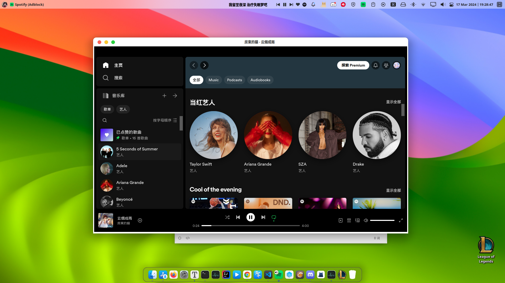
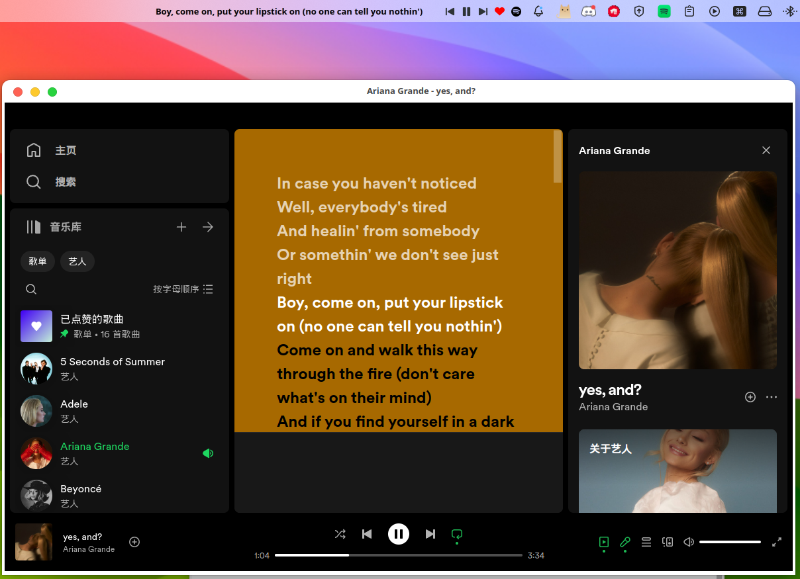
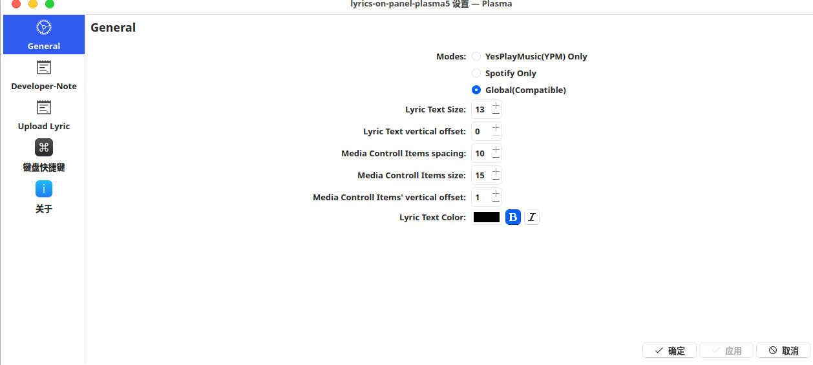

# Plasma6-Lyric-on-panel
> 适配最新的 **Plasma6** 桌面环境, Plasma5版本请移步 **master branch**
> **近乎完美地**实现了 MacOS 下 网易云音乐 的 歌词顶栏显示 功能
>
> MacOS原效果参考：https://blog.csdn.net/weixin_34061200/article/details/112693092 或自行下载网易云音乐进行对比。
>
> 
>
> 
>
> 采用两套逻辑： 
>
>  	1. YesPlayMusic （YPM）： 直接从 YPM 暴露在本地的端口获取 当前播放歌曲的歌词
>  	2. Compatible（兼容）： 从 Lrclib开源 歌词数据库中 通过（歌手，曲名，专辑名）fetch歌词。 若 不存在这三个参数的 精确匹配的结果，则用歌曲名做一次模糊查询
>
> 通过 Mpris2 数据源 获取当前播放音乐的所属媒体源。兼容模式 理论适用于**所有正确实现了 Mpris2 规范的播放器**，这包括通过 Google Chrome 在线播放的流媒体平台。兼容模式下， 主流歌曲 **歌词匹配成功率** **超过95%**

## 1. Screen Shortcuts

* Fullscreen Shortcuts

* Panel Only

* Synchronized lyrics (Even more precise then Spotify!)

* Freedom of Customizing every component of this widget

