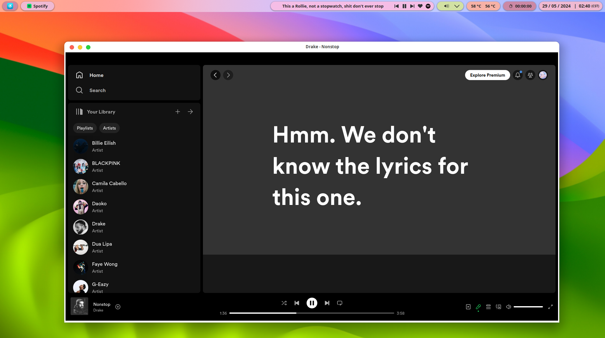
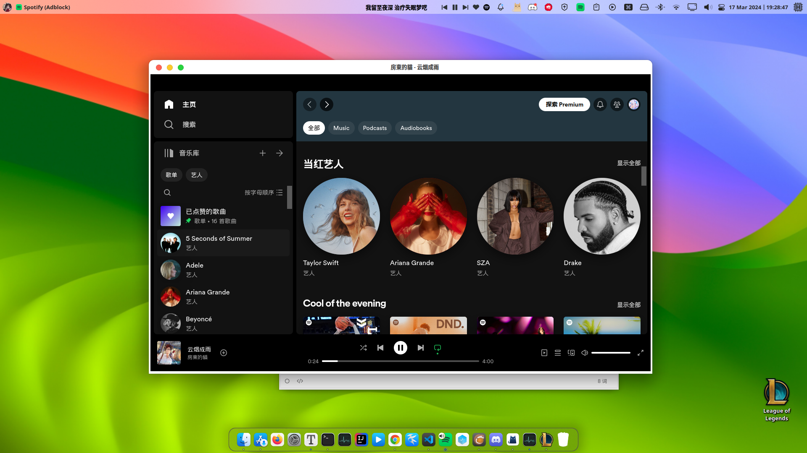
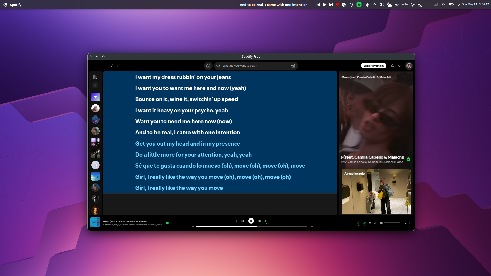
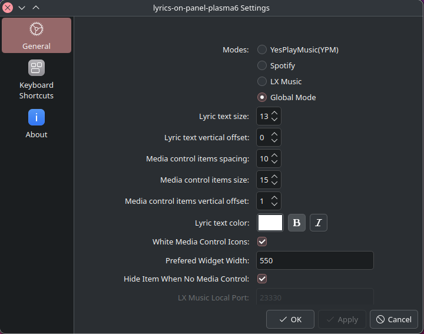

<h1 align="center">Lyrics-on-Panel</h1>

<p align="center">
  <a href="https://drive.google.com/file/d/1wo_2CpBg5cgbhNJqyb9LIaSVA5LmSR2S/view?usp=drive_link" target="_blank">
  	点击查看DEMO视频 (Watch demo video)
  </a>
</p>

<p align="center">
  
</p>
<p align="center"><b><code>在屏幕的任何地方显示正在播放音乐的歌词  
</code></b></p>
<p align="center"><b><code>Display lyrics of the currently playing music anywhere on the screen</code></b></p>

----

### 功能介绍  (Features)

本插件**完美还原**了MacOS 下「网易云音乐/QQ音乐」的歌词顶栏显示功能。  

> This plugin perfectly replicates the top-bar lyrics display feature of NetEase Cloud Music on macOS.  

👉 原始效果参考：[CSDN 博文链接](https://blog.csdn.net/weixin_34061200/article/details/112693092)  

> 👉 For the original effect reference, see: [CSDN Blog Link](https://blog.csdn.net/weixin_34061200/article/details/112693092)   

----

### 工作原理  (How it works)

* 从Mpris2数据源中获取当前播放歌曲以及播放器的信息。全局模式适用于所有正确实现了**[MPRIS2 规范](https://specifications.freedesktop.org/mpris-spec/latest/)** 的播放器。

  > Retrieve information of currently playing music and music-player from the MPRIS2 data source. The Global Mode mentioned below is compatible and should work with any players that correctly implement the **[MPRIS2 specification](https://specifications.freedesktop.org/mpris-spec/latest/)**.

  * 目前已知支持(Currently tested with)：
    * Spotify
    * LX Music
    * SPlayer
    * Youtube Music
    * Netease Cloud Music (Not wine version)
    * Apple Music
    * SPlayer

* 根据歌曲信息，采用三套逻辑进行歌词抓取：  

  > This plugin uses three approaches to fetch lyrics:

  1. YesPlayMusic模式 (YesPlayMusic Mode)  https://github.com/qier222/YesPlayMusic  
     从 YesPlayMusic 暴露在本地的端口获取当前播放歌曲的歌词。  

     > Fetches lyrics of the currently playing music from the local port exposed by YesPlayMusic. 

  2. LX Music 模式 (LX Music Mode)  **[lx-music-desktop](https://github.com/lyswhut/lx-music-desktop)**
       v2 后端通过 LX Music 官方 Open API SSE 实时获取歌词。请先在 LX Music 中启用开放 API；端口沿用插件配置。

     > The v2 backend uses LX Music's official Open API SSE stream. Enable the Open API in LX Music first; the port continues to use the widget setting.

  3. SPlayer 模式 (SPlayer Mode)  **[SPlayer](https://github.com/imsyy/SPlayer)**
       从 SPlayer 暴露在本地的端口获取当前播放歌曲的歌词
       仅2026.1.4以后构建的版本可用[3eda65d](https://github.com/imsyy/SPlayer/commit/3eda65dd89fdebade373f20b5890add6ac3ab3df)

     > Fetches lyrics of the currently playing music from the local port exposed by SPlayer.
     > Only builds from version 2026.1.4 onwards are available.[3eda65d](https://github.com/imsyy/SPlayer/commit/3eda65dd89fdebade373f20b5890add6ac3ab3df)

  4. 全局模式 (Global Mode)
     从 [**LrcLib**](https://lrclib.net/) 歌词数据库中根据 **`歌手`、`曲名`、`专辑名`** 精确匹配歌词。若无匹配结果，则使用 **歌名** 模糊查询。  
  
     > Fetches lyrics from the [Lrclib](https://lrclib.net/) lyrics database by precisely matching the `artist`, `music(track) title`, and `album name`. If no result is found, then fallback to a fuzzy search using only the **song title**. 

----

### 安装指南 (Installation Guide)

#### KDE

> 针对KDE Plasma， 我们提供两套版本，分别是纯QML实现以及QML前端配合Rust后端。具体请见v1.4和v2.0的ChangeLog。

>> For KDE Plasma, we provide two versions: a pure QML implementation and a QML frontend with a Rust backend. Please refer to the ChangeLog for v1.4 and v2.0 for details.

当前仓库版本仅保证在 **KDE Plasma 6** 下工作。 如需要 **KDE Plasma5** 版本，请在 [**KDE Store**](https://store.kde.org/p/2138263) 或 [**Plasma5 分支**](https://github.com/KangweiZhu/lyrics-on-panel/tree/plasma5) 进行下载。

> The current repository version only supports **KDE Plasma 6**. If you need the **KDE Plasma5** version, please download it from the [**KDE Store**](https://store.kde.org/p/2138263) or the [**Plasma5 branch**](https://github.com/KangweiZhu/lyrics-on-panel/tree/plasma5).  

Plasma5版本是**可用但过时**的版本，许多在新版本加入的功能， 以及Bug修复都尚未应用在Plasma5版本。

> Plasma5 version is **usable but outdated**. Many features and bug fixes introduced in the new version are not applied to the Plasma5 version.


有**两种安装方式**可选：  

> As for **installing the widget,** you will have 2 approaches:  

1. 无论是v1（**纯QML实现， 传统模式**）还是v2（**更灵活与精确的模式**）, 都推荐使用 KDE 官方提供的图形界面方式安装**前端**，详见[此链接](https://userbase.kde.org/Plasma/Installing_Plasmoids)。  ****

   > Regardless of whether you are using v1 (**pure QML implementation, legacy mode**) or v2 (**a more flexible and precise mode**), it is recommended to install the **frontend** using the GUI method provided by the KDE official website  (see [this link](https://userbase.kde.org/Plasma/Installing_Plasmoids)). 
   
   


2. 也可以通过命令行完成**v1/v2**前端的安装

   > you can use the following commands to test and install:

   ```bash
   yay -S plasma-sdk
   git clone git@github.com:KangweiZhu/lyrics-on-panel.git
   cd lyrics-on-panel/kde/v2 # or cd lyrics-on-panel/kde/v1 if you want v1
   kpackagetool6 -t Plasma/Applet -i .
   ```


* ⚠️⚠️⚠️**v2需要额外的Rust后端才能够工作。在 Arch Linux 下, 后端可以通过以下命令完成安装。**⚠️⚠️⚠️

  > Note that v2 (**a more flexible and precise mode**) requires an additional Rust backend to make the frontend work. **The backend can be installed on Arch Linux with the following commands.**

  ```
  git clone git@github.com:KangweiZhu/lyrics-on-panel.git
  cd lyrics-on-panel
  chmod +x scripts/install-backend.sh
  ./scripts/install-backend.sh
  ```


#### DMS


----

### 展示（Showcase）  

#### KDE Plasma6（配合 [**Panel Coloizer**](https://github.com/luisbocanegra/plasma-panel-colorizer)）
> Under KDE Plasma 6 (With [**Panel Coloizer**](https://github.com/luisbocanegra/plasma-panel-colorizer)).



  

  


---

  

  


#### KDE Plasma 5

> Under KDE Plasma 5  

  

  


---

  

  


#### 仅在面板中显示（Panel Only）  

> Display only on Panel Only  
>
> 

  


  

  


---

  

  


#### 同步歌词显示（Synchronized Lyrics）  

> Synchronized lyrics  

  

  


---

  

  


#### 配置页面  (Configuration Page)

> Freedom of customizing every component of this widget  

<p align="center">
  
</p>

## Star History

[](https://www.star-history.com/#KangweiZhu/lyrics-on-panel&type=date&legend=top-left)
